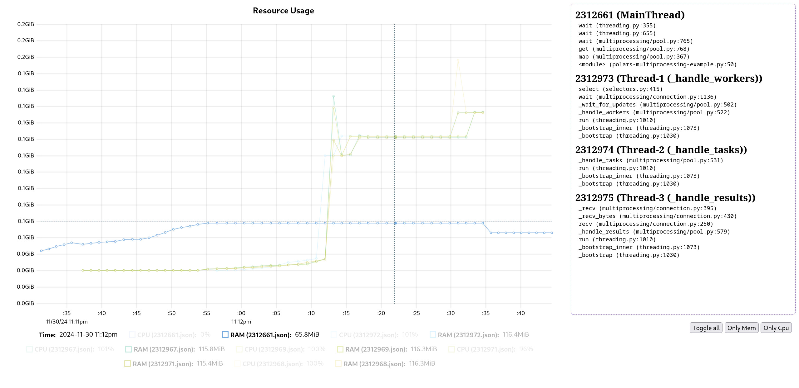

<div align="center">
  <h1>A crude Python resource monitor/profiler</h1>
</div>

`py-crude-resource-monitor` is a Rust application that leverages
[py-spy](https://github.com/benfred/py-spy) to capture snapshots of a target
process (including any subprocesses) at regular intervals.
It correlates the stacktraces with the current CPU and memory usage (RSS) of
each process.
This data can then be graphed over time, to interactively find out which
methods are being executed when your code starts to consume a lot of memory or
CPU.

Existing profilers, like `py-spy`, do not capture memory usage.
Existing memory profilers, like `memray`, attribute 90% of it to `unknown` in
my workload, which was not extremely helpful.

## Installation

You can install the tool using `cargo`:

```bash
cargo install --locked --git https://github.com/I-Al-Istannen/py-crude-resource-monitor.git
```

Or using `pixi`:

```bash
pixi global install py-crude-resource-monitor
```

## Screenshots




## Usage

> [!NOTE]
> On some systems, you might need to run the tool as root to be able to capture the process stack traces.
> If you are using Linux, you can also set the [Yama ptrace
> scope](https://www.kernel.org/doc/html/latest/admin-guide/LSM/Yama.html#ptrace-scope)
> to `0` or `1` instead.

```text
A small utility to monitor resource usage of Python processes

Usage: py-crude-resource-monitor <COMMAND>

Commands:
  profile  Profile a Python process
  view     Host a web server to view the profile data
  help     Print this message or the help of the given subcommand(s)

Options:
  -h, --help     Print help
  -V, --version  Print version
```

```text
Profile a Python process

Usage: py-crude-resource-monitor profile [OPTIONS] --output-dir <OUTPUT_DIR> <--pid <PID>|COMMAND>

Arguments:
  [COMMAND]...  The command to execute

Options:
  -p, --pid <PID>                  The PID of the Python process to monitor
  -o, --output-dir <OUTPUT_DIR>    output directory
  -s, --sample-rate <SAMPLE_RATE>  ms between samples
      --native                     capture native stack traces
  -h, --help                       Print help
```

```text
Host a web server to view the profile data

Usage: py-crude-resource-monitor view [OPTIONS] <OUTPUT_DIR>

Arguments:
  <OUTPUT_DIR>  output directory

Options:
      --port <PORT>            The port to listen on [default: 3000]
      --interface <INTERFACE>  The interface to listen on [default: 0.0.0.0]
  -h, --help                   Print help
```
